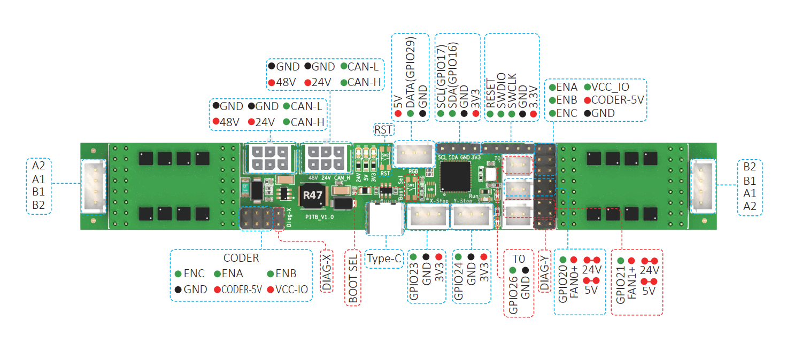

FYSETC, DFH, and frank.af present  
Party in the Back
=================

[FYSETC Repository here](https://github.com/FYSETC/FYSETC-PITB)

A CAN-enabled 24-60V dual driver printer control board, sized to fit on the rear extrusion of CoreXY printers.

### Features

* Only 150x20mm, with centered mounting holes to fit right on your extrusion
* RP2040 Microprocessor
* TMC5160 Drivers, using FYSETC's BIG5160 modules for up to 60V 6A per stepper
* Two fan control connectors, either 5V or 24V selectable
* Thermistor connector, for reading chamber temperatures
* Two endstop connectors, 3.3V logic level
* Neopixel RGB connectors
* I2C connector for smart peripherals (displays, sensors, and more)

### [Get started with Firmware](./firmware/)

