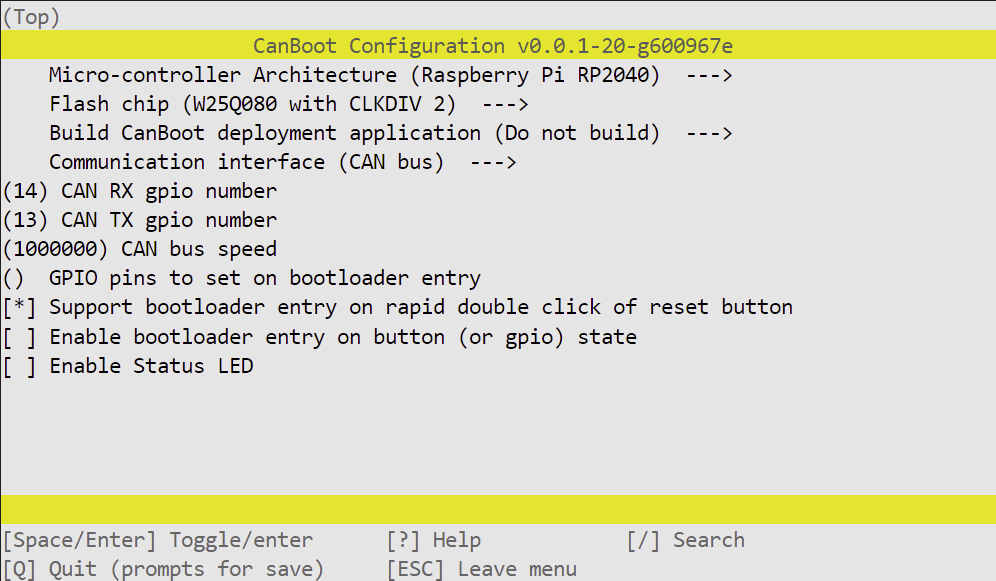
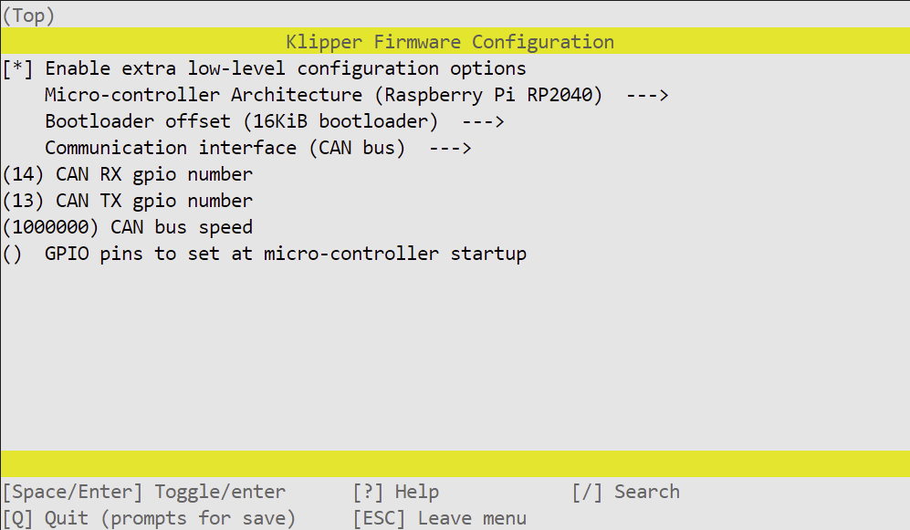

CanBoot
=======

I highly recommend flashing [Arksine's CanBoot bootloader](https://github.com/Arksine/CanBoot), to make future firmware updates far easier.



Note, you may need to change the CAN bus speed to match your network, although I recommend running above 650,000bps when using two CAN boards.

Connect PITB using a USB-C cable, and press RESET while holding the BOOTSEL button. PITB will present itself to your computer as a USB storage device. Copy the generated `out/canboot.uf2` to PITB and it should reset, and be ready to continue over CAN.

Klipper Configuration
=====================



Again, make sure the CAN bus speed matches your network.

You can identify your PITB's canbus_uuid using `~/klippy-env/bin/python ~/klipper/scripts/canbus_query.py can0`. I used `C0FFEEC0FFEE` here as an example, replace that with your UUID.

Use `~/klippy-env/bin/python ~/klipper/lib/canboot/flash_can.py -u "C0FFEEC0FFEE" -f "~/klipper/out/klipper.bin"` to flash your board

```ini
[mcu pitb]
canbus_uuid: C0FFEEC0FFEE
```

Aliases for board pins, so you can just say `pitb:FAN1` instead of needing to lookup `pitb:gpio21`

```ini 
[board_pins pitb]
mcu: pitb
aliases:
    ## Board enable LED
    LED_RUN=gpio15,

    ## Can pins. STANDBY can be pulled low if you're running USB to disable the transceiver
    ## https://www.nxp.com/docs/en/data-sheet/TJA1040.pdf page 4
    CAN_TX=gpio13, CAN_RX=gpio14, CAN_STANDBY=gpio25,

    ## SPI for motors. spi_bus: spi0a
    MISO=gpio0, MOSI=gpio3, SCLK=gpio2,

    ## Stepper pins
    MOT1_EN=gpio5, MOT1_CS=gpio6,  MOT1_DIR=gpio7,  MOT1_STEP=gpio8,
    MOT2_EN=gpio9, MOT2_CS=gpio10, MOT2_DIR=gpio11, MOT2_STEP=gpio12,

    ## Endstop pins, or DIAG with jumpers
    ENDSTOP_X=gpio23, ENDSTOP_Y=gpio24,

    ## I2C bus: i2c0e
    SCL=gpio17, SDA=gpio16,

    ## Other IO
    FAN0=gpio20, FAN1=gpio21, THERM0=gpio26,
    RGB=gpio29,
```

Stepper pin definitions, you'll need to include your printer's values. You can copy these from existing `[stepper_]` sections

```ini
[stepper_x]
step_pin = pitb:MOT1_STEP
dir_pin = pitb:MOT1_DIR
enable_pin = !pitb:MOT1_EN
endstop_pin = tmc5160_stepper_x:virtual_endstop
## These values are for a Voron 2.4, you need to use the correct values for your printer
# rotation_distance = 40
# microsteps = 16
# full_steps_per_rotation = 200
# position_min = 0
# position_endstop = 305
# position_max = 305
# homing_speed = 20
# homing_positive_dir = true
# homing_retract_dist = 0

[stepper_y]
step_pin = pitb:MOT2_STEP
dir_pin = pitb:MOT2_DIR
enable_pin = !pitb:MOT2_EN
endstop_pin = tmc5160_stepper_y:virtual_endstop
## These values are for a Voron 2.4, you need to use the correct values for your printer
# rotation_distance = 40
# microsteps = 16
# full_steps_per_rotation = 200
# position_min = 0
# position_endstop = 305
# position_max = 305
# homing_speed = 20
# homing_positive_dir = true
# homing_retract_dist = 0
```

PITB uses TMC5160 drivers, comment out or remove any other `[tmcXXXX stepper_x]` or `[tmcXXXX stepper_y]` sections. Configure `run_current` and `hold_current` to meet your needs

```ini
[tmc5160 stepper_x]
spi_bus = spi0a
cs_pin = pitb:MOT1_CS
diag0_pin = ^!pitb:ENDSTOP_X
run_current = 1
hold_current = 1
sense_resistor = 0.075
driver_sgt = 1

[tmc5160 stepper_y]
spi_bus = spi0a
cs_pin = pitb:MOT2_CS
diag0_pin = ^!pitb:ENDSTOP_Y
run_current = 1
hold_current = 1
sense_resistor = 0.075
driver_sgt = 1
```

The RP2040 on PITB has a builtin temperature sensor. This is only useful for seeing if the MCU is getting too hot, it will not give you any idea of chamber temperature

```ini
[temperature_sensor pitb_mcu]
sensor_type = temperature_mcu
sensor_mcu = pitb
```

The Thermistor port on PITB can be used for chamber temperature, the printed mount includes a slot to hold a standard hotend thermistor

```ini    
### Connect a spare thermistor to T0 for accurate chamber readings
[temperature_sensor chamber]
sensor_pin: pitb:THERM0
pullup_resistor: 4700
# sensor_type: ATC Semitec 104GT-2
# sensor_type: PT1000
```

PITB has two fan headers, which you can use to cool board and stepper drivers, your steppers, or anything else you may want to be blowing air for. Both 5V and 24V fans are usable, by moving the FAN0 and FAN1 power jumper

```ini
[fan pitb_fan_0]
pin: pitb:FAN0
max_power: 1.0

[fan pitb_fan_1]
pin: pitb:FAN1
max_power: 1.0
```

PITB has a connector for running Neopixel LEDs, such as the [Adafruit 16 NeoPixel Ring](https://amzn.to/3Cj2fHV)

```ini
[neopixel pitb]
pin: pitb:RGB
chain_count: 16
color_order: GRB
initial_RED: 0.3
initial_GREEN: 0.3
initial_BLUE: 0.3
```

As well, an I2C header is available. This can be used to drive SSD1306 displays, such as this [2.42" 128X64 OLED Module](https://amzn.to/3VhMmYL)

```ini
[display]
lcd_type: ssd1306
i2c_mcu: pitb
i2c_bus: i2c0e
```